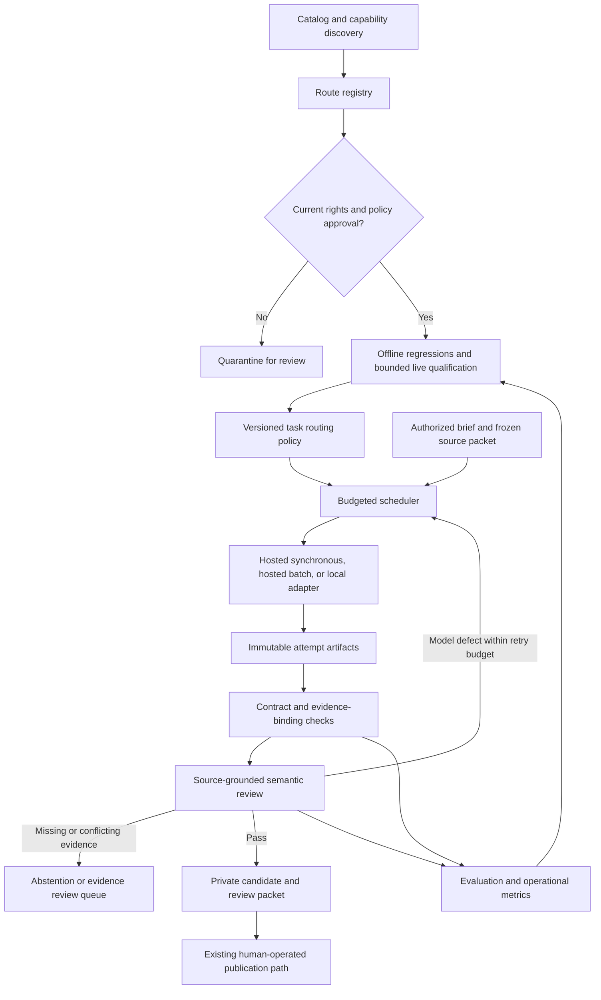

# Adaptive generation and continuous model qualification

Status: first implementation delivered, 2026-09-24. The human-selected hosted
runtime, daily catalog discovery, frozen-suite evaluator and worker v2 integration
are implemented. See [the operating workflow](MODEL-OPERATIONS.md) for exact
commands and current limits. The rest of this document describes the target
architecture; hosted batch, distributed accounting and automatic drift grading
remain future work. Model changes always require an explicit human choice.
Private experiments, source packets, rights reviews and handoffs stay outside the
checkout. Model selection never authorizes content publication.

## Objective and selection rule

Choose the least expensive **qualified route for the task**, subject to a quality
floor, source/output reuse rights, availability and a deadline. A route includes
model revision, provider, quantization where known, reasoning configuration,
transport, prompt/schema version and runtime version. A model name or parameter
count alone is not a qualification. Best fit can differ for generation, extraction,
causal review, contradiction detection and images.

Optimize measured cost per accepted, source-supported result, including failed
attempts and reviews. Track useful coverage and correct abstention so a model
cannot win by declining everything. Never trade a blocking factual defect or an
unreviewed commercial-training restriction for a cheaper response. No available
qualified route is an explicit operational outcome.

Daily discovery does not mean daily replacement. Keep a stable incumbent while
challengers are evaluated. Use fresh, comparable results, uncertainty intervals,
a minimum sample requirement and a material improvement threshold before changing
routing. Quality comes before cost; label small samples as inconclusive.

## Existing topology and extension points

| Component | Present behavior | Consequence for this plan |
|---|---|---|
| [`ops/local_generate.py`](../ops/local_generate.py) | Bounded Ollama generation; verifies captures and installed model/license digests; attaches measured provenance; refuses database/signing credentials | Reuse source validation and proposal construction. Extract shared contracts instead of maintaining separate hosted/local prompts. |
| [`ops/generation_worker.py`](../ops/generation_worker.py) | Postgres jobs, leases/fences and human briefs; v1 free endpoints retained, v2 dispatches the selected configurable runtime | Existing pause and lease checks surround a credential-isolated v2 inference child. Worker staging remains separate from proposal-only experiments. |
| [`0015_generation_jobs.sql`](../migrations/0015_generation_jobs.sql) | Operational jobs and legacy integer-cent reservations; v2 uses a shared private SQLite micro-dollar budget | Paid v2 text is supported on one operator host. Distributed/batch accounting needs future additive structures. Applied migration bytes remain unchanged. |
| [`0014_controlled_publication.sql`](../migrations/0014_controlled_publication.sql) | Brief/candidate staging, exact-digest approvals, publication receipts, separate worker role | Qualification is not content approval. Retain role separation and publication control. |
| [`cc-publisher`](../crates/cc-publisher/src/lib.rs) | Candidate validation, source capture binding, dates, edge endpoints, exact approvals, current-head checks and signed commit | Existing admission remains mandatory. It does not establish semantic entailment merely because excerpts are valid. |
| [`cc-authoring`](../crates/cc-authoring/src/admission.rs) and [`vendor/tt`](../vendor/tt/README.md) | Identity/admission and pinned upstream ontology | Adapt generation to these contracts; do not adapt identity, ontology or ledger semantics to a model. |
| [`ops/evidence_eval.py`](../ops/evidence_eval.py) | Offline API-certificate evaluation and externally graded consumer comparisons | Keep its graph-feasibility scope. Add a separate generation evaluator; a `Supported` graph verdict is not a model-quality score. |
| [`Dockerfile`](../Dockerfile), [`fly.toml`](../fly.toml) | Rust node/publisher/migrator/tick and Python model tools in the immutable runtime image | Tools are available but no persistent generation service is enabled by deployment. The anchor tick is not a generation scheduler. |
| [Media contract](TYPED-MEDIA-ABSENCE.md) and image generators under `ops/` | Separate media provenance and explicit absence | Text qualification does not qualify an image model. Keep media outside historical evidence and claim identity. |

The legacy v1 and local text paths differ in their original prompt and provenance
construction. The new v2 hosted runtime shares the local proposal builder. The hosted worker asks models to reproduce measured source fields;
the local path attaches those fields in software. Converge on the latter.
The hosted worker's saved `model-response.json` is an operational cache, not a
complete immutable record of provider responses, costs and every failed attempt.
Its socket timeout is also not a reliable total attempt deadline. These are
specific integration gaps, not reasons to replace the ledger.

## Proposed flow

Every route-selection decision retains eligible and rejected alternatives, the
policy/evaluation versions, reason for selection, expected cost, deadline and
any escalation reason. Catalog discovery and evaluation have no staging,
approval, signing or production-ledger permissions. The generation worker uses
its scoped operational role; the publisher remains a separate boundary.

## Target contracts and extension points

Use versioned, strictly validated JSON contracts. Unknown fields, nonfinite money,
missing rights, malformed hashes and unrecognized states fail closed. Artifacts
are immutable and stored privately with restrictive permissions. Store paths and
hashes in operational tables, not prompts, captures or secrets in public code.

| Contract | Required information |
|---|---|
| `cc.model-route.v1` | Stable route ID; exact requested/returned model/provider; hosted revision known/unknown; local weight/tokenizer/quantization/runtime digests; context and output limits; supported reasoning settings; transport/capabilities; observed prices and observation time |
| `cc.model-rights.v1` | Exact route scope; model, runtime, router and provider license/terms URLs and captured digests; commercial output use, downstream training/distillation and redistribution assessments separately; conditions; reviewer, review/expiry times; policy version; explicit unknown/denied/approved statuses |
| `cc.generation-task.v1` | Brief hash; task class/domain/language; frozen source and source-rights manifest; requested text/media components; ontology/prompt/schema versions; maximum cost, deadline, attempt/review limits; permissible routes; publication posture |
| `cc.inference-attempt.v1` | Task/attempt IDs; selected route/configuration; request/response hashes; remote request/batch IDs; start/end and finish reason; typed error; token/usage/cost observations; reservation and settlement references; retry lineage; output/validation hashes |
| `cc.generation-result.v1` | Outcome `proposal`, `abstained`, `needs_evidence`, `conflicting_evidence`, or `failed`; completeness per requested component; candidate hash only for proposals; missing facts and review findings; measured provenance |
| `cc.model-evaluation.v1` | Frozen case/rubric hashes; split and evaluation version; route configuration; every case/attempt outcome; deterministic and semantic scores separately; reviewer provenance/disagreements; denominators and uncertainty; elapsed time and full cost |
| `cc.routing-policy.v1` | Eligible rights/evaluation references; per-task quality floors; incumbent/challengers; bounded exploration, retries and spend; promotion/expiry rules; fallback order and circuit breakers; effective version and rollback target |

An abstention is a valid **generation result**, not an empty publishable candidate.
The current publisher requires nonempty entries; do not weaken that invariant to
represent a successful refusal. Missing event time must remain unknown. A
model-generated proposal that cannot express the task under the current envelope
is held for review, not padded with an invented date.

Prompts receive source IDs and selected passages. Models return source IDs and
span indices; software attaches exact captured bytes and measured metadata.
Reject invalid spans. Never repair historical prose or silently normalize a
nonliteral quotation into apparently original evidence. Formatting-only adapters
must preserve authored text and retain the original response.

## Rights qualification and discovery

1. Refresh catalog, availability, prices and capabilities daily, using caches and
   explicit observation timestamps. Discovery only creates candidate routes.
2. Resolve exact model and serving terms, including router terms and source reuse
   policy. Apache/MIT weights alone do not approve every host or source. Free
   price and permission for a provider to train are separate from our commercial
   downstream-training rights.
3. Compare retained terms and revisions. A changed legal grant, unknown revision,
   expiry, prohibited route or unresolved term moves the route to review. Do not
   convert an LLM's legal summary into authorization. A reviewer may record that
   a page-layout-only change leaves the grant unchanged.
4. Only reviewed routes may receive source packets or paid qualification calls.
   Keep provider pinning and disable unreviewed router fallbacks. A qualified
   model on a different provider is a different route.
5. Recheck the pinned policy before submission and before accepting an artifact.
   A new restriction stops new use; pending results are quarantined for a
   time-specific review. Do not retroactively erase old signed provenance.

Initial exploration is the reviewed Qwen family. Keep model names and current
rankings in private policy data, not in routing code. Different Qwen releases can
have different licenses. The same registry design must later support unrelated
permissive families and image routes with their own task-specific qualifications.

## Perpetual testing and cross-checking

Separate cheap offline software regression tests, bounded live qualification,
shadow comparisons and ongoing drift monitoring. CI runs deterministic synthetic
adapter/evaluator fixtures without provider keys. The live evaluator runs as an
explicitly enabled operational service with its own budget and no publisher.

Freeze cases and source packets before collecting outcomes. Maintain development,
held-out qualification and rotating audit sets; keep labels out of generation
prompts. Repeatedly tuning to one NASA example does not establish general quality.
Use multiple domains, dates and languages before qualifying those task classes.
Retain old failures as regressions while reserving unseen cases for promotion.

Qualification must include sampling parameters, output-token allowance and wall
deadline alongside reasoning effort. A reasoning response can exhaust its token
allowance before returning usable content; a lower cap is not necessarily cheaper
per accepted result. Short probes can pass while complete proposals invent facts
inside evidence rationales or misassign citation roles. Require both kinds of test
and a transfer packet before selecting an experimental incumbent.

Validate evaluator fixtures against the pinned ontology before paid calls. If a
fixture is defective, retain the original attempts and costs, record the exclusion,
and rerun a corrected version. Retesting frozen development cases after tuning
does not create held-out evidence. A rate-limited reviewer is unavailable, never
a passing review. Retain its unresolved charge reservation until reconciled.

Do not require a fixed edge count when the evidence may support fewer links.
Exact-count briefs can conflict with instructions to abstain and induce a model to
package an acknowledged inference as a sourced causal edge. Allow omitted links,
score their reasons, and preserve reviewer disagreements. A complete graph and a
second model's approval cannot replace checking each mechanism against its passage.

Required case families:

- Complete entry construction, all requested text fields, bounded summaries,
  taxonomy conformance and literal evidence attachment.
- Supported direct causal mechanisms versus sequence, proximity, speculation or
  an unsupported mechanism within an otherwise real causal chain.
- Missing sources, incomplete dates, calendar/timezone ambiguity and chronology
  reference times that are not event timestamps.
- Conflicting sources, later corrections, announcements versus observed events,
  duplicate claims, incompatible causal directions and cross-entry consistency.
- Source prompt injection, invalid source IDs/spans, malformed/truncated JSON,
  missing components and unsupported image assertions.
- Operational failures: 429, timeout after acceptance, partial batches, changed
  provider/revision, unsupported reasoning configuration, stale leases and pause.

Score factual support and temporal/causal coherence across **every field**,
including metadata rationales, not just the summary. Report structural completion,
source support, unsupported assertions, useful coverage, correct/incorrect
abstentions, review failures, latency, availability and cost separately. API
failure is not an incorrect historical answer; both affect delivered usefulness.
Record reasons for exclusions and never drop failed calls from cost denominators.

Cross-check a candidate against the frozen sources using a separate reviewed
route. Hide author identity and other reviewers' verdicts; forbid self-review.
Same-family agreement is correlated evidence about model behavior, not independent
historical corroboration. Add cross-family review when qualified routes exist.
Reviewers themselves need fault-seeded evaluation for both missed errors and false
alarms. Deterministic failures cannot be voted away. A disagreement or incomplete
review remains unresolved until source-based adjudication; no majority-vote truth.

Begin with review of every proposed candidate and full causal/date checks. Only
reduce sampling under a versioned policy supported by audit results. Sample
apparently clean accepted drafts as well as failures to expose silent errors.
Retain human correction feedback outside the repo; make a synthetic regression
where possible, preserving the original private evidence. Do not send private
ledger content to a newly discovered model without matching data-use authority.

Measure quality at candidate and chain level: unsupported-edge rate, inconsistent
event dates, conflicting identities, duplicate nodes, evidence independence,
correction/rejection rate and useful connected coverage. More nodes or edges and
more model agreement are not evidence of a better chain. Read-only ledger context
must have an explicit observation coordinate; existing `as_of` does not promise
full bitemporal replay.

## Routing, graceful failure and promotion

Classify the task using explicit requested components, context size and evidence
properties. Filter by rights, task qualification, context/capabilities, health,
budget and deadline. Choose the least expensive eligible route using measured
end-to-end cost. Unknown usage is unknown cost, never zero. Keep local energy,
hardware amortization and operating overhead separate from hosted API charges.

A policy may try a cheaper reasoning configuration, then a qualified alternative
when bounded checks detect a model defect. Reasoning level is part of the route;
lower effort must earn its own qualification. Bigger is not automatically better,
and newer is not automatically a permissible substitute.

| Failure | Required response |
|---|---|
| Temporary overload/429 | Respect retry hints, bounded jitter/backoff, provider concurrency limit and circuit breaker; an eligible alternate may be used |
| Truncation/incomplete component | Retain raw response; bounded retry with a qualified token/reasoning configuration; never accept partial JSON |
| Format or deterministic contract defect | Return specific findings to a fresh model attempt within the task budget; preserve every previous output |
| Unsupported assertion/date/causal mechanism | Reject the draft; bounded regeneration or qualified independent route; unresolved review goes to the owner |
| Missing source or unresolved historical contradiction | Abstain/request evidence review; a larger model cannot supply the missing evidence by confidence |
| Unknown/changed rights, revoked route or exhausted spend | Hold; do not fallback around policy |
| Ambiguous remote submission outcome | Reconcile remote request/job state before resubmission; retain reservation and duplicate risk |

Promotion is per task class, never a global model popularity rank. Specify quality
floors, critical error categories, sample sizes, allowed uncertainty and a material
cost/latency improvement **before** evaluating a challenger. Zero critical failures
in a small sample is necessary but not proof of a zero error rate. Bootstrap with
owner-reviewed promotions. Humans must choose every promotion and rollback.
Automation may recommend a change, but never activate it; content publication
remains separately governed.

Start challengers in shadow mode. Limit canary traffic and exploration spend;
require repeatable improvement, minimum residency and expiry to avoid churn. Keep
last-known-good routing versions and immediate quarantine/rollback on critical
regression. Rollback affects future jobs, never the recorded model on an old entry.
If the incumbent is no longer permissible or qualified, stop rather than reuse it.

## Batch execution and local inference

Define a transport-neutral adapter surface: capabilities, price estimate, submit,
inspect, collect and cancel. Synchronous calls can implement submit/collect in one
attempt; asynchronous batch and local jobs use the same result contract. Cancellation
is best effort and is not evidence that a provider stopped work or charging.

Distinguish a client-side parallel test batch from a provider's asynchronous batch
API. Discounts and batch availability require current, route-specific verification;
none are assumed. A future provider batch must pin route/settings and rights for
each item. Group only compatible requests and respect deadlines and data policy.
Persist remote IDs before polling; join outputs by unique item ID rather than
position. Validate each response independently, detect missing/duplicate/unknown
items, and retry failed items only. Accepted partial results do not hide failures.

Use a durable submission-intent record, fencing and reconciliation around the
remote-submit boundary. Exactly-once remote inference cannot be promised without
provider idempotency support. A short worker lease must not cover a many-hour
remote batch: persist state, release the lease, then reacquire to poll or collect.
Guard all transitions, including collection after pause or rights expiry. Preserve
returned bytes in quarantine while preventing progression to the review queue.

Reserve maximum approved spend transactionally before a call or batch. Add
integer micro-USD reservation/settlement records instead of treating paid text as
zero cents. Charge all reasoning/output, retries, reviewers, explorations and
unknown-outcome submissions against scoped limits. Keep conservative holds where
usage is absent; reconcile reported charges without releasing the same hold twice.
Reserve across midnight and concurrent workers correctly. Split production,
qualification, shadow and exploration budgets; expose spent, held and available
amounts. No automated top-ups or increases in authorized ceilings.

A local adapter pins actual weights, tokenizer, quantization, runtime and license
bytes before and after generation. Requalify on hardware/runtime/quantization
changes that can alter outputs. Measure queueing and cold start alongside tokens/s,
memory, power and uptime. Benchmark a small Qwen on available hardware before
promising a cost advantage. Local operation can reuse qualified prompts and
contracts; it must earn the same semantic quality floor and abstention behavior.

Images require an independent route/policy and visual-quality review. Text model
success must not silently create an image or a deliberate media-absence record.
A complete-entry checklist must retain `not_requested`, `pending`, `failed` and
`generated` distinctly without changing the signed media contract.

## Implementation sequence and acceptance

Each step is a separate reviewable change, with runtime behavior disabled until
its explicit operational enablement. Proposed module names below do not describe
files that already exist.

1. **Common contracts and replayable evaluator.** Add `ops/model_contracts.py`,
   `ops/model_eval.py` and synthetic fixtures. Extract reusable source binding and
   proposal construction from `local_generate.py`; keep its CLI compatible. Add
   the non-proposal result envelope. Validate preserved authored bytes, full-field
   source grading, nonliteral spans, proper abstention and schema/version errors.
   Acceptance: saved permitted-model responses can be evaluated offline with no
   database, network, credentials or content repair; grading limitations are clear.
2. **Reviewed route registry and adapters.** Add `ops/model_registry.py` and
   `ops/model_adapters/` for pinned OpenRouter synchronous and Ollama transports.
   Record exact attempts, completion/usage, observed capabilities and total
   deadlines. Keep secrets in environment/runtime stores, never payload archives.
   Acceptance: replay fixtures cover truncation, provider mismatch, changed terms,
   unsupported reasoning, withheld usage, redirects and credential isolation.
3. **Worker integration and accounting.** Replace the fixed inference loop through
   the shared runner; use scoped operational credentials and separate experiment
   execution. Add a new forward migration for attempt, reservation/settlement and
   route-decision state; preserve all applied SQL bytes. Paid generation remains
   opt-in through a versioned owner policy. Acceptance: real-Postgres concurrency,
   crash recovery, pause, lease fencing, budget and publisher-role tests pass.
4. **Continuous qualification and adaptive routing.** Add `ops/model_evaluate.py`
   for bounded live runs and `ops/model_router.py` for deterministic policy
   decisions. Keep catalog polling separate from live calls. Add private reports
   showing comparisons, reasoning, source findings, rights expiry and cost per
   accepted result. Acceptance: replay a model regression and rights change;
   challenger quarantine, hold and rollback work without ledger writes. Exercise
   cross-review false positives and shared-family failures before automatic use.
5. **Asynchronous batch, then local capacity.** Extend adapters only after verifying
   supported provider contracts; add remote reconciliation and item-level recovery.
   Operate the evaluator in its own pinned runtime with least privilege, private
   storage, retention and restore procedures. Acceptance: interrupt submission,
   polling and collection; reorder/duplicate/omit results; pause mid-batch; revoke a
   route; restore operational state. Then compare local Qwen at equal quality,
   including throughput and all-in cost.

For relevant implementation changes run `make check`, the Wasm build and
`python3 -m unittest discover -s ops -p 'test_*.py'`. Use real isolated Postgres for
stateful tests. Docker acceptance must exercise the exact immutable image on
synthetic data and cannot target production. Preserve owner-run digest deployment,
skip-start behavior, tick tag+digest reconciliation, compatible migration recovery
and backup/restore checks. No daily evaluator is activated by merging a branch.

The first production milestone is a qualified proposal-and-review loop, with
explicit human publication and observable costs. Broader automatic publication
would need a separate owner/governance decision; model adaptation alone does not
supply that authorization.
